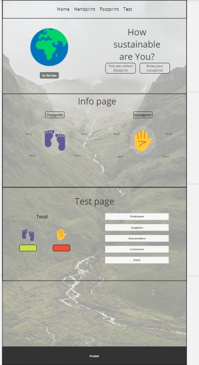

> _Fork_ deze leertaak en ga aan de slag. Onderstaande outline ga je gedurende deze taak in jouw eigen GitHub omgeving uitwerken. De instructie vind je, zoals altijd, in: [docs/INSTRUCTIONS.md](docs/INSTRUCTIONS.md)

# Titel
CrossmarX carbon footprint calculator for small businesses

## Inhoudsopgave

  * [Beschrijving](#beschrijving)
  * [Kenmerken](#kenmerken)
  * [Bronnen](#bronnen)
  * [Licentie](#licentie)

## Beschrijving
<!-- In de Beschrijving staat hoe je project er uit ziet, hoe het werkt en wat je er mee kan. -->
The goal of this project is to create a web application that calculates the carbon footprint and handprint of small businesses. The owner or stakeholders of the business can see how good or bad the business is doing on the topic of sustainibilty. The calculator will include the following stakeholders/category: employees, suppliers, shareholders, customers, and other. The idea is that the user will fill out a form with questions per category (stakeholder) which results in a score that you can see per category but it will also show a total score of every category together. This way the user can see the overall doing of the business and also per category to see where it might needs improvement. There will also be a page with information on the topics of footprint and handprint to give the user a better idea and knowledge of what these actually mean.
<!-- Voeg een mooie poster visual toe 📸 --

<!-- Voeg een link toe naar Github Pages 🌐-->

## Kenmerken
<!-- Bij Kenmerken staat welke technieken zijn gebruikt en hoe. Wat is de HTML structuur? Wat zijn de belangrijkste dingen in CSS? Wat is er met Javascript gedaan en hoe? Misschien heb je een framework of library gebruikt? -->

## Licentie

This project is licensed under the terms of the [MIT license](./LICENSE).
